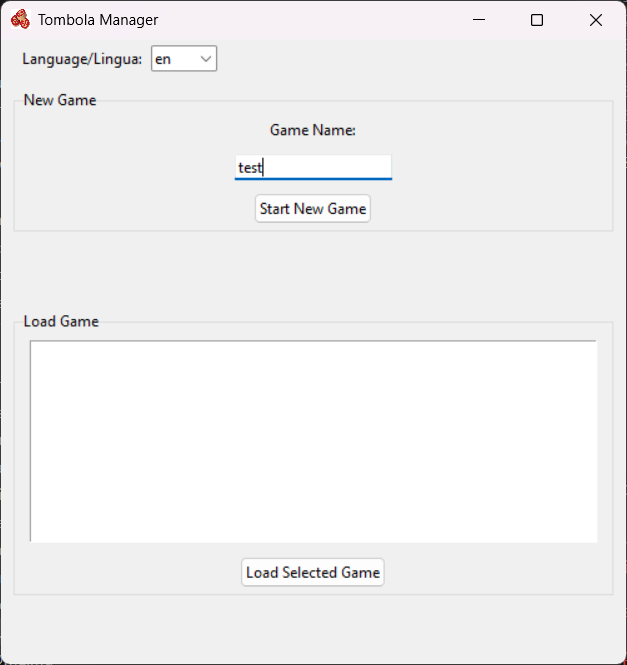
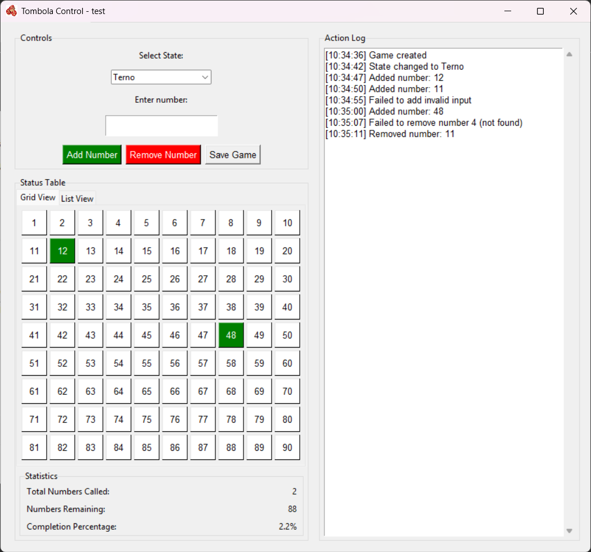

# Tombola Manager

A desktop application to manage Tombola (Italian Bingo) games with real-time visualization and game state tracking.


## Features

### Main Window

- Create new games with custom names
- Load previously saved games
- Maintains a list of all saved games

### View Window

- Large, clear display of all numbers (1-90)
- Color-coded number display:
  - Green: Last called number
  - Bold Black: Previously called numbers
  - Light Gray: Uncalled numbers
- Game state display (Ambo, Terno, etc.)

### Control Window

- Number input for calling/removing numbers
- Game state selection (Ambo, Terno, Quaterna, Cinquina, Tombola, SUPERBINGO)
- Multiple views for called/uncalled numbers:
  - Grid View: Visual representation of all numbers
  - List View: Organized list of called and remaining numbers
- Statistics panel showing:
  - Total numbers called
  - Numbers remaining
  - Completion percentage
- Real-time action log
- Auto-save feature

## Building the Application

### Prerequisites
- Python 3.7 or higher

### Installing the Package

1. Navigate to the project directory
2. Install the `tombolamanager` package:
   ```
   pip install -e .
   ```

### Creating an Executable

1. Navigate to the project directory
2. Run the build script:
   ```
   create_exe.bat
   ```
   Or manually:
   ```
   pyinstaller --onefile ^
            --noconsole ^
            --icon=src/tombola_manager/icon/icon.ico ^
            --windowed ^
            --name="Tombola Manager" ^
            --add-data "src/tombola_manager/icon/icon.ico;src/tombola_manager/icon" ^
            main.py
   ```

The executable will be created in the `dist` directory.

## Game States

The game progresses through the following states:
1. Ambo (2 numbers in a row)
2. Terno (3 numbers in a row)
3. Quaterna (4 numbers in a row)
4. Cinquina (5 numbers in a row)
5. Tombola (Full card)
6. SUPERBINGO (Optional bonus round)

## Save Files

Games are automatically saved in JSON format in the `games` directory, storing:
- Called numbers
- Game state
- Action log
- Timestamps
- Last called number